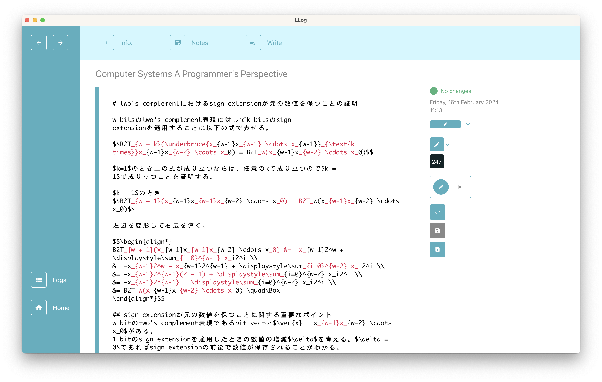

In the current version, I have only implemented some basic features of the application and this application is prototyping. So the app's UI and features can be often changed or updated.

## What is LLog?


"LLog" is abbreviated for "learning logs" and is an application for managing your learning progress by logging.

You can manage "what and when you learn" and know "when you should review what you learned" by this application.





## Features

- You can manage the progress of what you learned.
- You can write markdown notes for what you learned.
- You can make a log and know when you should review what you learned.
- You can search contents, notes, and logs with multiple conditions.

## How to start using LLog.

Operation confirmation of this application was only on mac OS Monterey.

1. Clone this repository.

```
git clone https://github.com/awyaki/llog.git
```

2. Move to the created directory and install all depending libraries.

```
cd llog && npm install
```

3. Generate files involved in database operations.

```
npx prisma generate
```

4. Run the application.

```
npm start
```

## How to use

Here I concisely explain the example of the workflow so that you understand and become able to use the application. (I plan to make detailed explanation pages.)

### 1. Create a New "Content" from a Name and "Blocks"

When you will start using this application at the first time, you will create a thing called "content" on the home page of the application. A content is a large unit of managing your learning progress.

How to use a content I expected is that you aollocate one content to one book.
For example, I expect you will create a content for the book "The Art of Readable Code" on the basic usage. Of cource you can also create a content for managing anything exept books like web articles.

To add a new content, you have to open a UI for adding a new content by clicking the "Add new" button on the home page.

Whenever you add a new content, you will see a input feild for "Blocks" on the bottom of a input feild of a content name.

The term "block" is a small unit of managing your learning progress, and I assume that you map blocks to pages of a book or whatever you want to manage its progress.
For example, if you want to manage the learning progress of the book "The Art of Readable Code" you will create 204 blocks because the book has 204 pages.

Filling in the required name and books fields, you become able to create new content.

### 2. Create a New Note on a Content

Once you add content to the application you become able to write notes for the content. When you create a new note, you can write a note by markdown and you can register some blocks to the note.

### 3. Create a Learning Log

Whenever you write a note, you can click "submit log button". In this application, the term "log" means log for what you learned. If the added log have some blocks, the level of all blocks are set to max level five.

Block-level values can be zero to five, and level zero means "the block has been not learned yet". Regarding levels, one to five, a higher level means "you more likely remenber what you learned on the blocks". More and more time is passed, block levels become lower and lower and the brightness of block color becomes lighter and lighter.

So when you review what you learned, you are recommended that you review lower-level blocks before higher-level blocks.

### 4. Review What You Learned by Reading Your Logs and Re-submit the Logs

You can see all logs that you have submitted on "Logs page" and can review what you have learned. On the logs page, you know "what you should review now" thanks to block-levels on the logs.

For example, if a log has level-one blocks you can understand you should give the biggest priority to review the log, and you can review the log in situ and submit a new log, which is copied from the original log.

That' s all the short explanation of a example of the workflow.
I hope your learning is going to be fine!

## Contact

Twitter @akiawy
